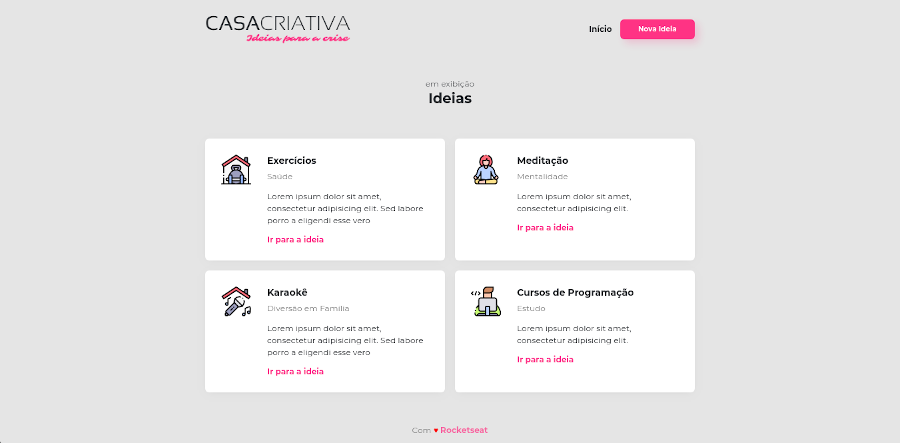

## 🏠 Casa Criativa - Ideias para a Crise

### 🗒 Sobre

A casa criativa é uma aplicação com objetivo de catalogar ideias como brincadeiras, jogos, filmes, entre outros, para a serem feitas
duranto o período da crise (pandemia da covid-19). Essa aplicação foi desenvolvida em um *workshop* realizado pela [Rocketseat](https://rocketseat.com.br/) no mês de
março de 2020. 

### 🔧 Tecnologias utilizadas
Para o desenvolvimento desta aplicação foram utilizadas as tecnologias:
  -  HTML
  -  CSS 
  -  Javascript 
  -  SQL.

### ❗️ Dependências 
  - Express
  - Nodemon 
  - Nunjucks
  - Sqlite3
  
 ### ⚙️ Rodar aplicação
  - Clone o repositório
  - Execute npm install (instalação de dependências)
  - Execute npm run dev 
  - Acesse via localhost:3000
  
  ### *Layout* da aplicação
  
  
  
  
  
